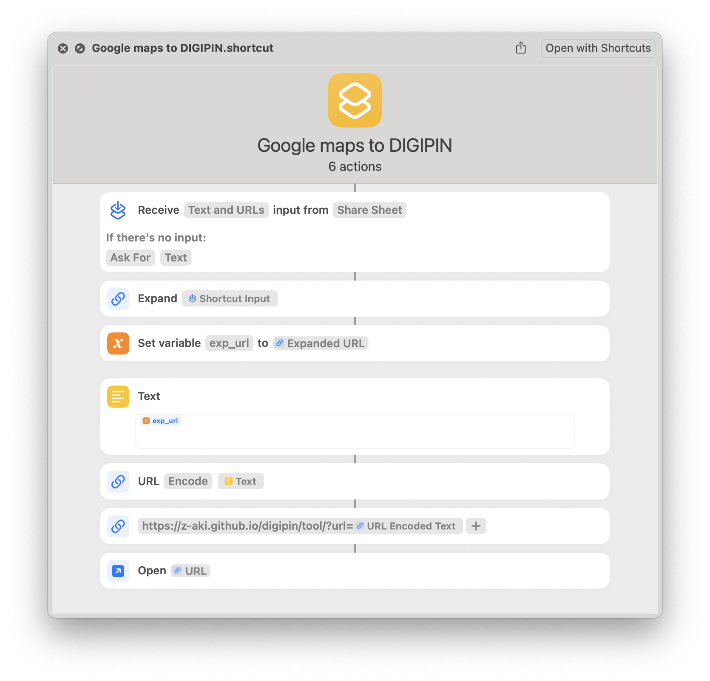
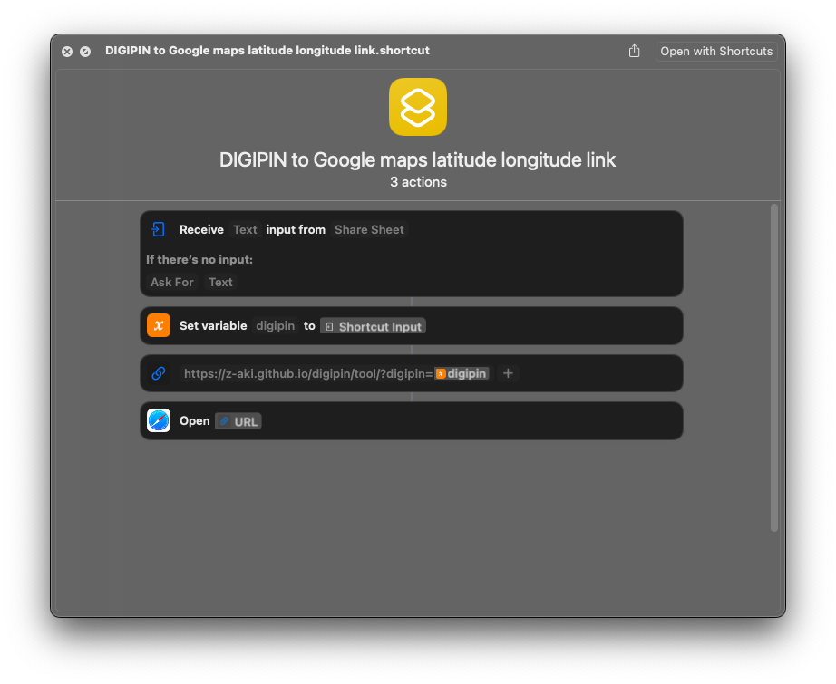

Convert digipin to latitude longitude for iOS, macOS, using shortcuts and Google Chrome, Firefox using tampermonkey scripts

- [Online tool](./tool.md)

- iOS and macOS shortcuts

    - [share maps URL to this shortcut using sharesheet](./Google maps to DIGIPIN.shortcut)
        
        

        
Click to see screenshot

            
        

    - [enter DIGIPIN in this shortcut and get maps URL](./DIGIPIN to Google maps latitude longitude link.shortcut)

        

        
Click to see screenshot

            
        

- [Tampermonkey script for desktop Mozilla Firefox and Google Chrome extension]()

    To use, right click on any place on the map and the second row in the context menu will be the DIGIPIN. Clicking on it will copy it.