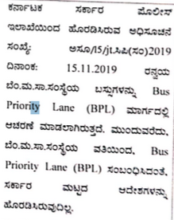

# BMTC

## CAFC meetings recently and transgender employees after reservation

:material-calendar: 19/05/2025

:fontawesome-solid-clipboard-question: 1. Please provide the calendar dates of all meetings of the Commuter Advisory and
Facilitation Committee CAFC since 01.01.2023.

:fontawesome-solid-clipboard-question: 2. Please provide the minutes of
meetings MoM, or summary or outcome report for all meetings listed in the reply of
point 1 above.

:material-reply-circle: :material-calendar: 23/05/2025

From 01.01.2023 till now, the meeting of the Consumer Advisory Committee has not been organized at the head office level of the BMTC and there are no proceedings.

-------

:fontawesome-solid-clipboard-question: 3. Please provide the head count and designation of transgender
people employed by the BMTC in any job role whatsoever.

:material-reply-circle: :material-calendar: 23/05/2025

The matter of transgender staff is related to the administrative branch and the application seeking information under the Act, 2005 has been forwarded to the administrative department under Section 6(3).

:material-reply-circle: by the Administrative Department :material-calendar: 19/06/2025

No transgender persons have been appointed to any position in the Bangalore Metropolitan Transport Corporation.

-------

## CAFC meetings ever

:material-calendar: 20/06/2025

:fontawesome-solid-clipboard-question: 1. Please provide all dates of CAFC committee meetings since its inception.

:fontawesome-solid-clipboard-question: 2. Please provide the agenda and minutes of the meetings and outcomes of the meetings listed in
the reply of point 1.

:fontawesome-solid-clipboard-question: 3. Please provide the full website url link where the reply information
of point 1 and 2 is available publicly.

:material-reply-circle: :material-calendar: 01/07/2025

The information requested is overwhelming. Due to the volume, please come to this office during office hours on 16.07.2025 to inspect the files and provide copies of the information under the Right to Information Act.

## Bus priority lane, pop-up lanes, card-less cash-less payments, last mile connectivity partnerships and Namma BMTC app promotion

:material-calendar: 20/06/2025

:fontawesome-solid-clipboard-question: 1. Please provide any documents, proposals, consultations, expression of intent, ideas, or
studies :material-calendar: after 01.01.2022 regarding BMTC bus priority lane, its implementation or
feasibility.

:material-reply-circle::material-calendar: 01/07/2025:

!!! note

    Translation Needed. See [contact me](../../about.md)

> 

Traffic police ???? 15.11.2019 The buses of the BMC are operated under Bus Priority Lane (BPL). Further, the BMTC has not issued any government-level orders regarding Bus Priority Lane (BPL).

-------

:fontawesome-solid-clipboard-question: 2. Please provide any documents, proposals, consultations, expression of intent,
ideas, or studies dated after 01.01.2022 regarding popup lanes or painting exclusivity/
priority warnings on the road in front of BMTC bus stops.

:material-reply-circle: :material-calendar: 01/07/2025:

No orders in this regard are available in this office.

-------

:fontawesome-solid-clipboard-question: 3. Please provide any documents,
proposals, consultations, expression of intent, ideas, or studies dated after 01.01.2022
regarding card-less and cashless ticket payments in BMTC buses. The intent was expressed
by the BMTC MD Mr Ramachandran R in an interview with Elets News Network (ENN) on the
date 20.07.2024 quoted

> One of our major initiatives is the implementation of the National
> Common Mobility Card (NCMC). We envision moving beyond even the need for physical
> cards. Almost everyone carries a mobile phone, so we aim to facilitate mobile-based
> payments. We aim to eliminate the need for any physical cards, allowing people to walk in
> and out of transport systems seamlessly. Similar to how FASTag works at toll plazas, GPS-
> based ticketing systems automatically calculate fares based on where passengers board and
> alight from the bus, deducting the fare from their account without human intervention.

  <https://egov.eletsonline.com/2024/07/bmtcs-journey-towards-cashless-contactless-public-transport/>

:material-reply-circle: :material-calendar: 01/07/2025:

The query has been forwarded to the Computer Department under Section 6(3) of the RTI Act 2005.

-------

:fontawesome-solid-clipboard-question: 4. Please provide any documents, proposals, consultations, expression of intent,
ideas, or studies dated after 01.01.2022 regarding increasing last mile connectivity in
streets using partnerships or incentivisation schemes with private autos or e-rikshas etc.

:material-reply-circle: :material-calendar: 01/07/2025:

There is no proposal in the office about it.

-------

:fontawesome-solid-clipboard-question: 5. Please provide the documents and scheme details dated after 01.01.2024 regarding
increasing adoption of Namma bmtc app both inside the bus (via posters, conductor
incentivisation, speaker announcements etc.,) and outside the bus (posters on the bus,
banners on bus stops etc).

:material-reply-circle: :material-calendar: 01/07/2025:

The application submitted has been forwarded to the Computer Department under Section 6(3).

## App corrections, route change and Namma BMTC app open-source

:material-calendar: 20/06/2025

:fontawesome-solid-clipboard-question: 1. Please provide the mechanism of reporting incorrect route or bus stop information on
the Namma BMTC app to the BMTC authority.

:material-reply-circle: :material-calendar: 21/06/2025:

Concerns can be raised in Play Store comments or write mail to
<supervisorsits@mybmtc.com>. BMTC team will take necessary measure to rectify the incorrect
route or bus stop.

-------

:fontawesome-solid-clipboard-question: 2. Please provide the mechanism of
requesting bus route changes or bus stop changes to the BMTC authority.

:material-reply-circle: :material-calendar: 21/06/2025:

Request can be made to traffic section of BMTC, Central office, Shantingara. After
thorough survey, needful measures will be taken.

-------

:fontawesome-solid-clipboard-question: 3. Please provide any proposals, documents, consultations etc. regarding making the source code of
the namma BMTC android or iOS app open (publicly available) and collectively improvable
by volunteer developers.

:material-reply-circle: :material-calendar: 21/06/2025:

Source code is not publicly available.

Appealed :material-calendar: 22/06/2025

:question:3. Appeal for point 3, to clarify, it requests whether there exist any proposals to convert
the apps into open-source mode. Please provide any proposals, documents, consultations
etc. regarding making the source code of the Namma BMTC android or iOS app open
(publicly available) and collectively improvable by volunteer developers. Thanks for the
prompt response on the RTI.

Appeal Hearing :material-calendar: 01/07/2025

Participants:

- First Appellate authority, the Chief System Manager (CSM): Mr. Sadananda K G,
- System Manager (SM):  Raghavendra Kumar M J,
- Deputy System Manager (DSM): Smt Priyanka A,
- Assistant Mechanical Engineer (AME): Mr Ananda M B (the PIO)
- An officer for transcription of the proceedings: Smt unknown.

Paraphrasing of the conversation:

- CSM: Why do you want the source code?
- Me: There are many issues which the developers in Bengaluru can fix and improve the app.
- CSM: We don't want anybody else to improve the app. We will carry this app project for 3-4 years as long as the contract is valid. That will be a big enough achievement for us. We are not looking for anything more than that.
- Me: .....
- CSM: Further, releasing the code can cause user privacy issues.
- Me: Open source doesn't cause that.
- CSM: Releasing the [app] source code can cause issues in the server where the service is hosted in the central Karnataka server.
- Me: Client code is different and doesn't affect the server. Many good and secure things are open source already like the Android, Chrome, Firefox that you're using. You can even monetize it by licensing it to other bus corporations in the country.
- CSM: This is our property. [smiles] Why should we share or give it away or sell it? We don't want to do it.
- Me: So it's a willpower issue?
- CSM: [leans back] No no.. it's not a willpower issue.
- AME: The app is under a contract basis with a third party and we will not have the code for the next 3-4 years. Only after the contract expires will we get the code and the knowledge transfer.
- Transcriptionist: Why don't you build a different and a better app ? Why do you need our source code?
- Me: A teenager tried in 2019 and you blocked his app by taking the APIs private, and asked him to be a bidder in the tender and take on the entire app responsibility.

    <https://linkedin.com/in/nihar1024>

    <https://timesofindia.indiatimes.com/city/bengaluru/bmtc-shows-door-to-teen-whose-bus-app-a-hit-among-passengers/articleshow/70111155.cms>

- AME: yes yes I remember this story. He had probably hacked our system. Because he was a kid, we only called him and his father to this office and did not take any legal action against him.
- DSM [comes in and gets the context]: [chitchat]
- CSM: This is our DSM. She's the technical person. I am a non-technical system manager.
- DSM: So do you want to contribute and participate in the development of this app?
- Me: If it were open source, I would do it for free.
- DSM: There is a contract with the vendor which doesn't have any such exit clause. If we had the code, we would **definitely** have done it.
- Me: Understood.
- Me to transcriptionist: Please reject the appeal under RTI section 8 1 d.

:material-reply-circle: :material-calendar: 01/07/2025:

Enquiry was called on 01.07.2025 at 14.30Hrs in the chambers of First Appellate Authority. Both the Appellant and the defendent[sic] were present for the enquiry. PIO informed that, since it comes under the intellectual property, copyrights and commercial confidence, as per 8(1)(d) of the RTI 2005, the source code cannot be given. The First Appeallate[sic] Authority agreed for the same and the enquiry was disposed [of].

-------
